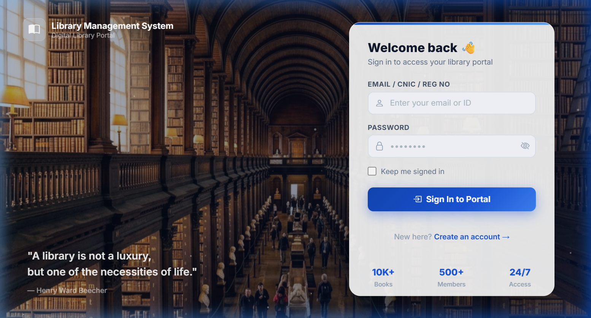
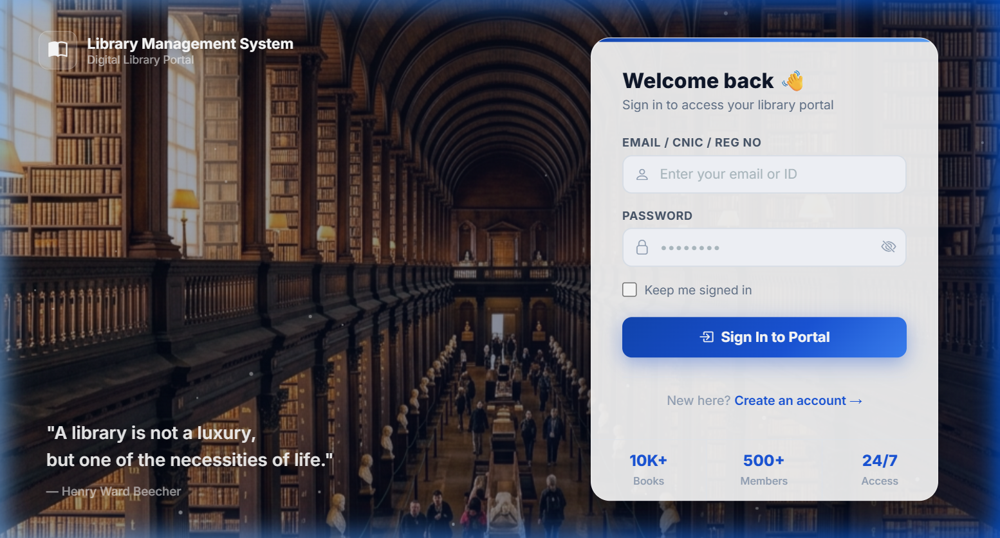

# 📚 Universal ERP — Library Management System

> A full-featured, role-based Library ERP built with PHP, MySQL, Bootstrap 5, and AdminLTE 4.  
> Theme: **Crimson & White** premium aesthetic with dynamic sidebar and RBAC.

## 🖼️ Visuals

<table border="0">
  <tr>
    <td width="50%">
      <p align="center"><b>Home / Landing Page</b></p>
      
    </td>
    <td width="50%">
      <p align="center"><b>Login Page</b></p>
      
    </td>
  </tr>
  <tr>
    <td width="50%" colspan="2">
      <p align="center"><b>Registration Page</b></p>
      
    </td>
  </tr>
</table>

---

## ✨ Key Features

- **🔐 Robust RBAC**: Comprehensive Role-Based Access Control for Super Admins, Librarians, Assistant Managers, and Students.
- **📚 Smart Circulation**: Seamless book issuance and return system with automatic fine calculation.
- **📊 Live Analytics**: Real-time KPI stats and operations feed for librarians.
- **🛡️ Audit Trails**: Detailed digital audit logs tracking every critical action in the system.
- **📋 Inventory Control**: Advanced management of book stock, categories, and authors.
- **💡 Student Portal**: Personal dashboard for students to track borrowings, pay fines, and request new books.

---

## 🏗️ Tech Stack

| Layer | Technology |
|---|---|
| Backend | PHP 8+ (PDO + MySQLi) |
| Database | MySQL (via XAMPP) |
| Frontend | Bootstrap 5, Bootstrap Icons, AdminLTE 4 |
| Auth | Session-based with RBAC |
| Styling | Vanilla CSS + `theme.css` global token system |

---

## 👥 Roles

| Role | Access Level |
|---|---|
| `super_admin` | Full system access — pages, users, roles |
| `librarian` | Full library operations + audit trail |
| `assistant_manager` | Circulation, inventory, student directory |
| `student` | Own dashboard — borrowings, fines, book discovery |

---

## 📄 Page Inventory

### 🔐 Authentication & Global
| File | Description |
|---|---|
| `login.php` | Unified login page for all roles with session creation |
| `logout.php` | Destroys session and redirects to login |
| `register.php` | Self-registration for new students |
| `profile.php` | Editable user profile page with avatar upload |
| `index.php` | Smart router that redirects users to their role-specific dashboard |

---

### 🎓 Student Dashboard (`dashboards/student/`)
| File | Description |
|---|---|
| `student_dashboard.php` | Student home — shows active borrowings, past history, fine summary, and live book discovery search |

---

### 📖 Librarian Dashboard (`dashboards/librarian/`)
| File | Description |
|---|---|
| `librarian_dashboard.php` | Main dashboard with live KPI stats, operations feed, most-borrowed book, and top student borrowers |
| `circulation.php` | Issue and return books with checkout modal; displays all active borrowings with overdue highlighting |
| `borrowing.php` | Detailed borrowing management view with fine enforcement and multi-status filtering |
| `circulation_logs.php` | Historical log of all completed (returned) transactions with date and fine details |
| `book_categories.php` | Category mastery — manage disciplines, toggle issueable status, and view per-category stock |
| `category_books.php` | Drill-down view of all books within a specific library category |
| `register_book.php` | Dual acquisition mode — register new books OR replenish stock of an existing title |
| `book_operations.php` | Full CRUD management for all books — edit metadata, delete, and manage stock |
| `manage_inventory.php` | Inventory control panel for viewing stock levels, availability ratios, and running reconciliation |
| `inventory_management.php` | Extended inventory analytics with stock health metrics per category |
| `book_details.php` | Full-profile modal-ready book detail page with borrow history, copy counts, and metadata |
| `student_directory.php` | Student roster with live search, borrow stats, fine balance, and direct checkout shortcut |
| `reset_student_password.php` | Allows librarians to reset a student's password by searching via name, email, or ID |
| `audit_trail.php` | Compact audit log showing recent library actions (issue, return, block events) |
| `digital_audit_trail.php` | Premium paginated audit trail with action-type filtering and timestamp details |
| `ajax_book_details.php` | AJAX endpoint — returns full book profile JSON for dynamic modals |
| `ajax_category_books.php` | AJAX endpoint — returns books list for a given category (used in category modal) |
| `ajax_student_vitals.php` | AJAX endpoint — returns a student's borrow limit, active loans, and fine balance |
| `ajax_update_limit.php` | AJAX endpoint — allows librarians to update a student's borrow limit dynamically |

---

### ⚙️ Super Admin Dashboard (`dashboards/super_admin/`)
| File | Description |
|---|---|
| `manage_pages.php` | Dynamic page registry — add, edit, delete menu entries and assign role access |
| `manage_roles.php` | Role configuration panel for the RBAC system |
| `manage_users.php` | User directory — list, search, and manage all system users across roles |

---

### 🧠 Core Modules (`core/`)
| File | Description |
|---|---|
| `library_functions.php` | Central `Library` class — all checkout/return logic, fine engine, stats, and analytics |
| `audit_helper.php` | Global `logAction()` function writing to `audit_logs` table |
| `session.php` | Session start, auth guard, public page whitelist, and role badge helper |
| `rbac_helper.php` / `rbac_helpers.php` | Helpers for checking page-level role access permissions |
| `config.php` | DB credentials and `BASE_URL` / `APP_ROOT` constants |
| `db.php` | PDO connection factory |

---

## ⚠️ Missing Features Per Page

### Circulation (`circulation.php`)
- ✅ **Barcode scan** support for book or student ID
- ✅ **Bulk issue/return** for events (e.g., classroom batch lending)
- ✅ **Due date extension** (renew) action directly from the active loans table

### Audit Trail
- ✅ **Export to PDF/Print** functionality integrated into Circulation Logs
- ✅ **Export to CSV** functionality integrated into Circulation Logs
- ✅ **Action-type filter** on the basic audit_trail.php

### Student Dashboard
- ✅ **Book reservation/hold request** for checked-out items
- ✅ **Fine payment gateway** (Simulated clearing)
- ✅ **Reading history export** (CSV) for student records
- ✅ **Notifications** for upcoming due dates (Auto-check on login)
- ✅ **Book rating/review** capability after returning

### Librarian Dashboard
- ✅ **Charts and visual analytics** — KPIs + Trend graphs + Doughnut distribution
- ✅ **Date range filter** on the operations feed
- ✅ **Overdue reminder / bulk notification** mechanism (Email/Notif simulation)

### Circulation (`circulation.php`)
- ✅ **Barcode scan** support for book or student ID
- ✅ **Bulk issue/return** for events (e.g., classroom batch lending)
- ✅ **Due date extension** (renew) action directly from the active loans table
### Book Operations / Register Book
- ✅ **Cover image upload** for books (surfaced in Inventory & Details UI)
- ✅ **Bulk CSV import** for adding many books at once
- ✅ **Duplicate ISBN detection warning** on new book form

### Student Directory
- ✅ **Bulk fine settlement** — select multiple students to clear dues in one click
- ✅ **Export to Excel/CSV** for the student roster

### Audit Trail
- ✅ **Export to PDF** functionality
- ✅ **Action-type filter** on the basic `audit_trail.php`

### Super Admin
- ✅ **Manage users** — custom password reset and role change supported
- ✅ **System settings page** (Branding, Fine rate, Borrow duration, Max book limit)
- ✅ **Backup/Restore** utility for database continuity

---

## 🚀 Enhancement Recommendations

### 🔥 High Priority (Closest to a Full LMS)

1. **Student Self-Reservation System**  
   Add a "Reserve" button in `student_dashboard.php` for books with zero available copies. When returned, notify the student automatically.

2. **Online Fine Payment (Simulated)**  
   Add a fine payment flow in the student dashboard — confirm payment, update `users.fines` to 0, log to audit trail.

3. **Email / SMS Notification Engine**  
   Use PHPMailer or a Mailgun API to send automated emails for: due-date reminders (3 days before), overdue alerts, reservation availability, fine receipts.

4. **Analytics Charts in Librarian Dashboard**  
   Integrate Chart.js to visualize: monthly issue/return trends, category popularity bar chart, overdue heatmap by week.

5. **Barcode / QR Code Support**  
   Generate QR codes for each book (via `phpqrcode` library) and allow the circulation page to scan-to-fill the book ID field via a camera API.

6. **Book Cover Image Upload**  
   The `cover_image` column already exists in `lib_books`. Wire up a file upload in `register_book.php` and display covers on `book_details.php` and the student discovery panel.

---

### 🟡 Medium Priority (Quality of Life)

7. **Renew / Extend Due Date from Circulation Page**  
   Add a "Renew" button in `circulation.php` that extends the due date by 7 days if the student has no fines.

8. **Bulk CSV Import for Books**  
   Add a CSV upload form in `register_book.php` to import a spreadsheet of books (title, author, ISBN, category, quantity) in one shot.

9. **System Settings Admin Page**  
   Create `dashboards/super_admin/system_settings.php` to let the super admin configure: fine rate per day, default borrow duration, max books per student, system name/logo, and contact email — stored in `system_settings` table.

10. **Student ID Card / Library Card Generator**  
    Generate a printable PDF library card (using TCPDF or DomPDF) from the student directory page.

11. **Report Generator**  
    Add a reports page for the librarian: Most borrowed books (date range), Overdue summary, Fine collected vs outstanding, Student activity report — all exportable as PDF/CSV.

12. **Dark Mode Toggle (Functional)**  
    The `theme-toggle` button in the header already exists but only switches Bootstrap's `data-bs-theme` attribute. Extend `theme.css` with full dark-mode token overrides.

---

### 🟢 New Feature Additions (Full LMS Roadmap)

| # | Feature | Description |
|---|---|---|
| 1 | **Digital Catalog (OPAC)** | A public-facing catalogue page (no login required) for browsing all available books, searchable by title/author/category/ISBN |
| 2 | **Inter-Library Loan** | Allow students to request books not owned by the library; track external loan status |
| 3 | **Reading List / Wishlist** | Students can add books to a personal reading list even if they don't borrow yet |
| 4 | **Book Review & Rating** | After returning, students can leave 1–5 star ratings and short reviews for each book |
| 5 | **Librarian Shift Log** | Track which librarian was on duty during each transaction for accountability |
| 6 | **Fee Structure Manager** | Admin can set per-category fine rates (e.g., reference books cost more per day late) |
| 7 | **Semester / Academic Year Rollover** | Archive old borrowing records at the end of a semester; generate a summary report |
| 8 | **Multi-Branch Support** | Add a `branch_id` to books and users to manage multiple library branches from one system |
| 9 | **Catalog Enrichment via ISBN API** | Auto-fetch book title, author, publisher, and cover from Open Library or Google Books API when an ISBN is entered |
| 10 | **Mobile-Responsive PWA** | Package the student dashboard as a Progressive Web App so students can add it to their phone home screen |

---

## 🗂️ Database Tables (Inferred)

| Table | Purpose |
|---|---|
| `users` | All users (students, librarians, admins) with `role`, `fines`, `borrow_limit` |
| `lib_books` | Book catalog with `total_copies`, `available_copies`, `is_issueable`, `cover_image` |
| `lib_authors` | Author registry |
| `lib_categories` | Book disciplines/categories |
| `lib_borrowings` | Active and historical borrow records with `status`, `fine_amount`, `due_date` |
| `lib_transactions` | Low-level action log (used by `logAction()` in the `Library` class) |
| `audit_logs` | High-level audit log written by `audit_helper.php` |
| `sys_pages` | Dynamic page registry for RBAC-driven sidebar |
| `role_access` | Pivot table mapping `role_key` ↔ `page_id` |
| `system_settings` | Key-value store for system name, logo, and configuration |

---

## 📁 Project Structure

```
universal/
├── assets/
│   └── css/
│       └── theme.css          ← Global premium theme tokens
├── core/
│   ├── library_functions.php  ← Library class (checkout/return engine)
│   ├── audit_helper.php       ← logAction() helper
│   ├── session.php            ← Auth guard
│   └── config.php             ← DB + BASE_URL
├── dashboards/
│   ├── student/               ← 1 page
│   ├── librarian/             ← 19 pages + 4 AJAX endpoints
│   └── super_admin/           ← 3 pages
├── database/                  ← SQL schema & seed scripts
├── includes/
│   ├── header.php             ← Global HTML head, nav, RBAC gatekeeper
│   ├── sidebar.php            ← Dynamic RBAC-driven sidebar builder
│   └── footer.php             ← Closing tags + Bootstrap JS
├── login.php
├── logout.php
├── register.php
├── profile.php
└── index.php                  ← Role-based redirect router
```

---

## 🛠️ Setup

1. Import the SQL files in `/database/` into a MySQL database named `universal_db`
2. Configure `core/config.php` with your DB credentials and `BASE_URL`
3. Place the project in `htdocs/universal/`
4. Visit `http://localhost/universal/`

---

*Generated: April 2026 | Universal ERP Library Module | PHP + MySQL + Bootstrap 5*
